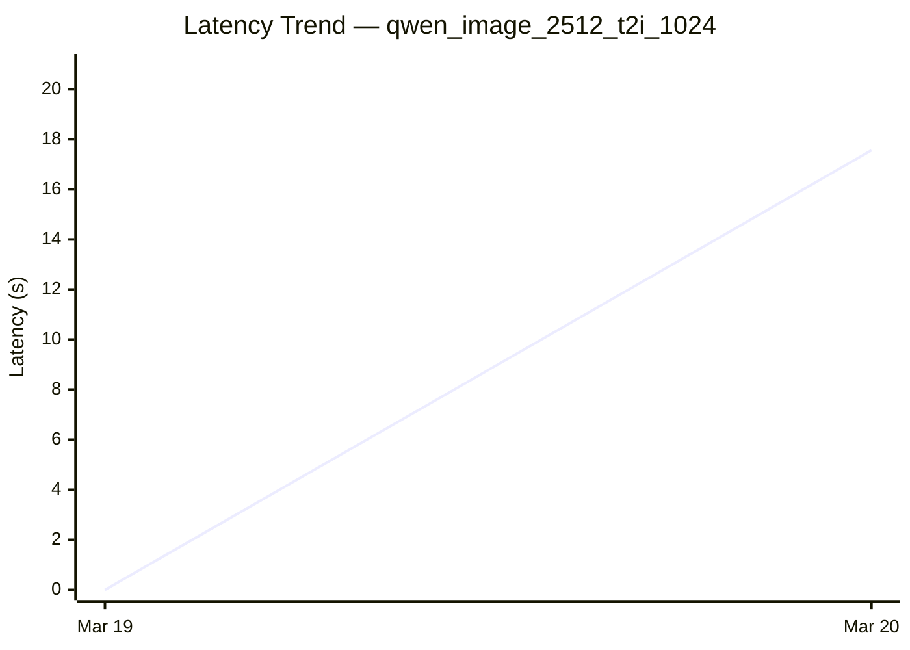
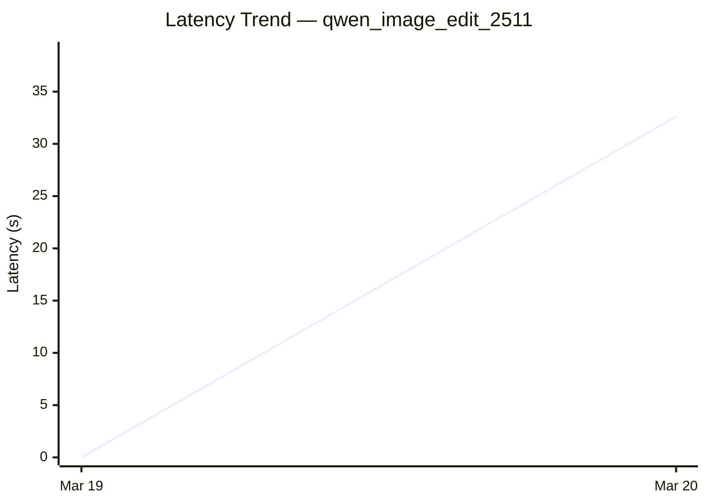
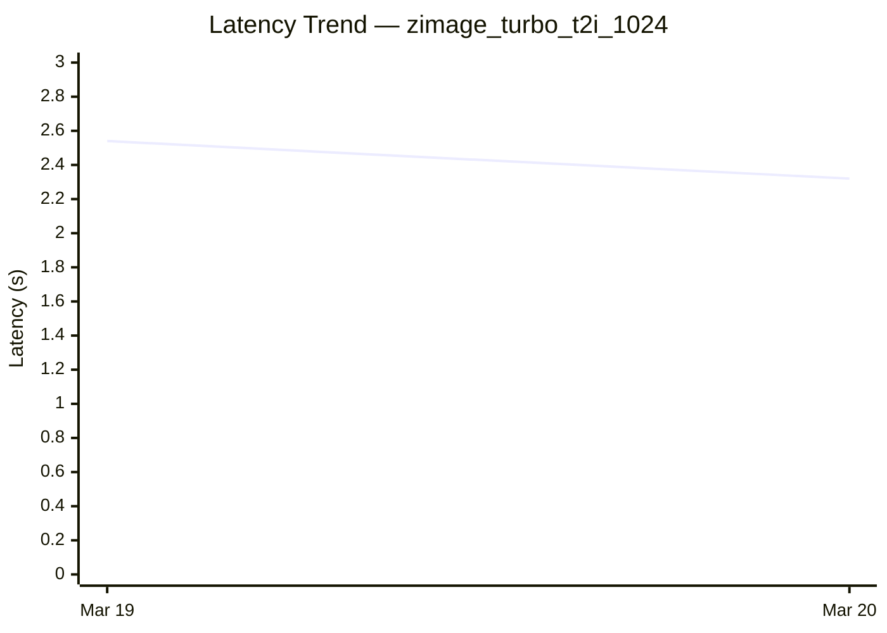

# Diffusion Cross-Framework Performance Dashboard

*Generated: Mar 20 | Commit: `b4642ac`*

## Cross-Framework Performance Comparison

| Model | Task | sglang (s) |
|-------|------|---------|
| FLUX.1-dev | text-to-image | **7.05** |
| FLUX.2-dev | text-to-image | N/A |
| Qwen-Image-2512 | text-to-image | **17.56** |
| Qwen-Image-Edit-2511 | image-edit | **32.61** |
| Z-Image-Turbo | text-to-image | **2.32** |
| Wan2.2-T2V-A14B-Diffusers | text-to-video | N/A |
| Wan2.2-TI2V-5B-Diffusers | text-image-to-video | N/A |
| Wan2.2-I2V-A14B-Diffusers | image-to-video | N/A |
| HunyuanVideo | text-to-video | N/A |

## SGLang Performance Trend (Last 7 Runs)

| Date | Commit | flux1_dev_t2i_1024 (s) | flux2_dev_t2i_1024 (s) | qwen_image_2512_t2i_1024 (s) | qwen_image_edit_2511 (s) | zimage_turbo_t2i_1024 (s) | wan22_t2v_a14b_720p (s) | wan22_ti2v_5b_720p (s) | wan22_i2v_a14b_720p (s) | hunyuanvideo_t2v_480p (s) | Trend |
|------|--------|---------|---------|---------|---------|---------|---------|---------|---------|---------|-------|
| Mar 20 | `b4642ac` | 7.05 | N/A | 17.56 | 32.61 | 2.32 | N/A | N/A | N/A | N/A | :arrow_down:     :arrow_down:     |
| Mar 19 | `3d8690f` | 7.59 | N/A | N/A | N/A | 2.54 | N/A | N/A | N/A | N/A | — |

### Latency Trend: flux1_dev_t2i_1024

```mermaid
xychart-beta
  title "Latency Trend — flux1_dev_t2i_1024"
  x-axis ["Mar 19", "Mar 20"]
  y-axis "Latency (s)" 0 --> 9
  line [7.59, 7.05]
```

*SGLang performance over time*


### Latency Trend: flux2_dev_t2i_1024

```mermaid
xychart-beta
  title "Latency Trend — flux2_dev_t2i_1024"
  x-axis ["Mar 19", "Mar 20"]
  y-axis "Latency (s)" 0 --> 0
  line [0.00, 0.00]
```

*SGLang performance over time*


### Latency Trend: qwen_image_2512_t2i_1024



*SGLang performance over time*


### Latency Trend: qwen_image_edit_2511



*SGLang performance over time*


### Latency Trend: zimage_turbo_t2i_1024



*SGLang performance over time*


### Latency Trend: wan22_t2v_a14b_720p

```mermaid
xychart-beta
  title "Latency Trend — wan22_t2v_a14b_720p"
  x-axis ["Mar 19", "Mar 20"]
  y-axis "Latency (s)" 0 --> 0
  line [0.00, 0.00]
```

*SGLang performance over time*


### Latency Trend: wan22_ti2v_5b_720p

```mermaid
xychart-beta
  title "Latency Trend — wan22_ti2v_5b_720p"
  x-axis ["Mar 19", "Mar 20"]
  y-axis "Latency (s)" 0 --> 0
  line [0.00, 0.00]
```

*SGLang performance over time*


### Latency Trend: wan22_i2v_a14b_720p

```mermaid
xychart-beta
  title "Latency Trend — wan22_i2v_a14b_720p"
  x-axis ["Mar 19", "Mar 20"]
  y-axis "Latency (s)" 0 --> 0
  line [0.00, 0.00]
```

*SGLang performance over time*


### Latency Trend: hunyuanvideo_t2v_480p

```mermaid
xychart-beta
  title "Latency Trend — hunyuanvideo_t2v_480p"
  x-axis ["Mar 19", "Mar 20"]
  y-axis "Latency (s)" 0 --> 0
  line [0.00, 0.00]
```

*SGLang performance over time*


---
*Generated by `generate_diffusion_dashboard.py` in SGLang nightly CI.*
