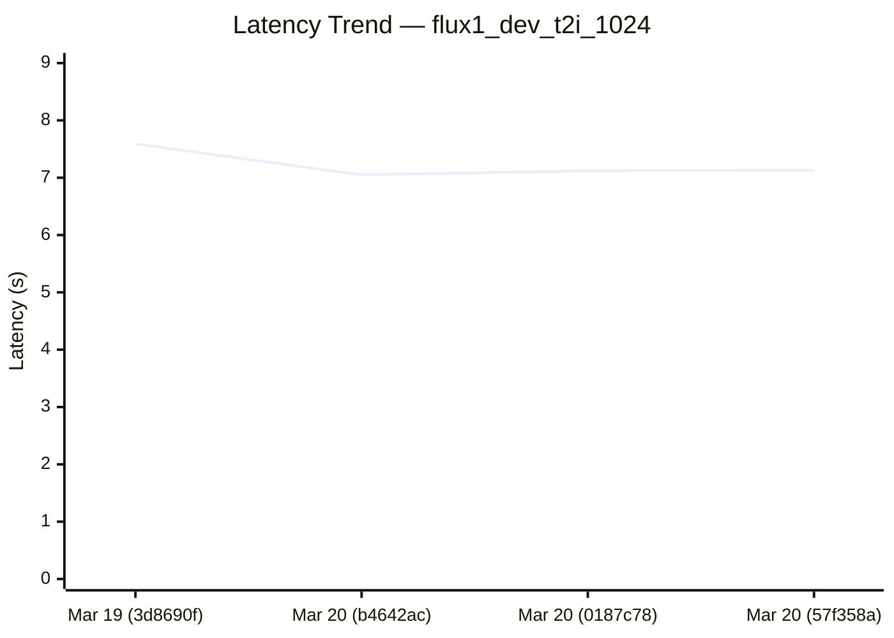
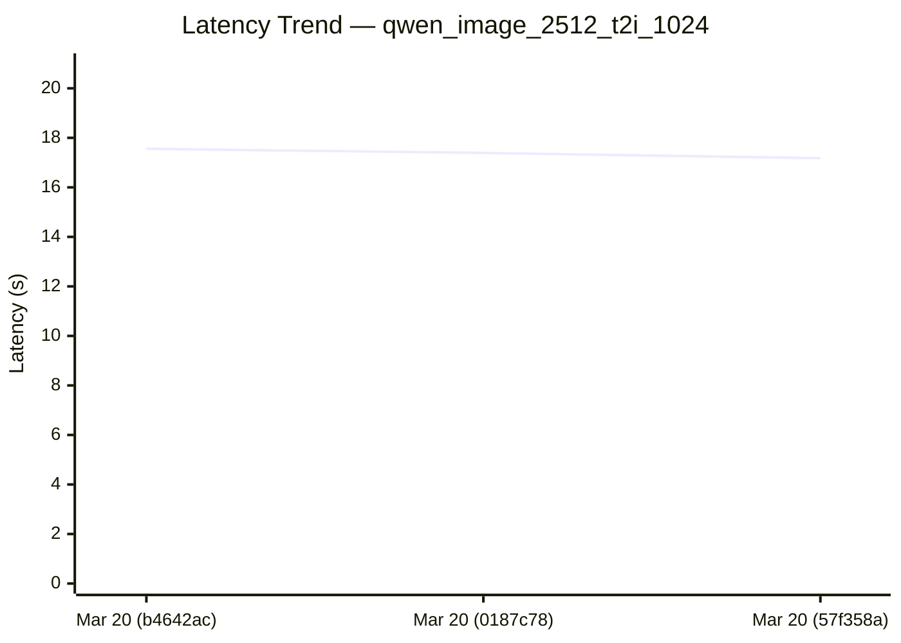
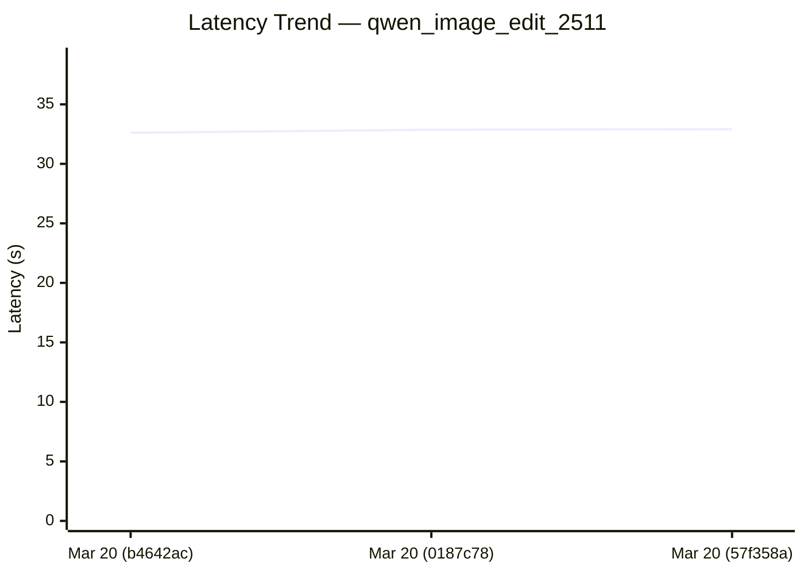
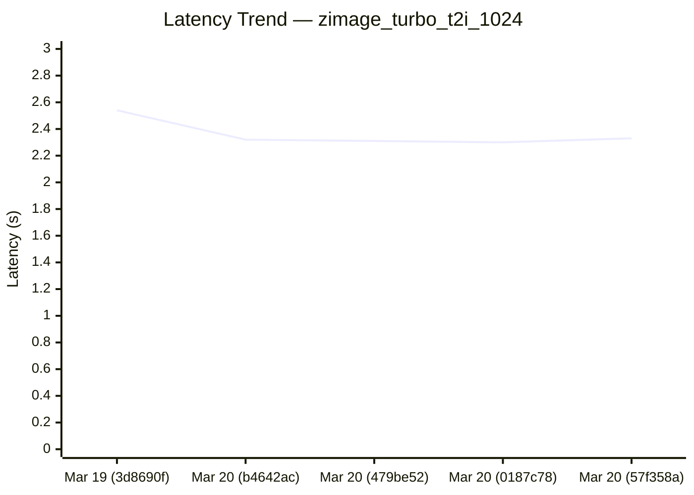

# Diffusion Cross-Framework Performance Dashboard

*Generated: Mar 20 | Commit: `57f358a`*

## Cross-Framework Performance Comparison

| Model | sglang (s) |
|-------|---------|
| FLUX.1-dev | **7.13** |
| FLUX.2-dev | **24.05** |
| Qwen-Image-2512 | **17.18** |
| Qwen-Image-Edit-2511 | **32.91** |
| Z-Image-Turbo | **2.33** |
| Wan2.2-T2V-A14B-Diffusers | N/A |
| Wan2.2-TI2V-5B-Diffusers | N/A |
| Wan2.2-I2V-A14B-Diffusers | **10.04** |

## SGLang Performance Trend (Last 7 Runs)

| Date | Commit | flux1_dev_t2i_1024 (s) | flux2_dev_t2i_1024 (s) | qwen_image_2512_t2i_1024 (s) | qwen_image_edit_2511 (s) | zimage_turbo_t2i_1024 (s) | wan22_t2v_a14b_720p (s) | wan22_ti2v_5b_720p (s) | wan22_i2v_a14b_720p (s) | Trend |
|------|--------|---------|---------|---------|---------|---------|---------|---------|---------|-------|
| Mar 20 | `57f358a` | 7.13 | 24.05 | 17.18 | 32.91 | 2.33 | N/A | N/A | 10.04 | :left_right_arrow:   :left_right_arrow:  :left_right_arrow:  :left_right_arrow:    |
| Mar 20 | `0187c78` | 7.12 | N/A | 17.39 | 32.87 | 2.30 | N/A | N/A | N/A |     :left_right_arrow:    |
| Mar 20 | `479be52` | N/A | N/A | N/A | N/A | 2.31 | 17.44 | N/A | N/A |     :left_right_arrow:    |
| Mar 20 | `b4642ac` | 7.05 | N/A | 17.56 | 32.61 | 2.32 | N/A | N/A | N/A | :arrow_down:     :arrow_down:    |
| Mar 19 | `3d8690f` | 7.59 | N/A | N/A | N/A | 2.54 | N/A | N/A | N/A | — |

### Latency Trend: flux1_dev_t2i_1024



*SGLang performance over time*


### Latency Trend: flux2_dev_t2i_1024

```mermaid
xychart-beta
  title "Latency Trend — flux2_dev_t2i_1024"
  x-axis ["Mar 20 (57f358a)"]
  y-axis "Latency (s)" 0 --> 29
  line [24.05]
```

*SGLang performance over time*


### Latency Trend: qwen_image_2512_t2i_1024



*SGLang performance over time*


### Latency Trend: qwen_image_edit_2511



*SGLang performance over time*


### Latency Trend: zimage_turbo_t2i_1024



*SGLang performance over time*


### Latency Trend: wan22_t2v_a14b_720p

```mermaid
xychart-beta
  title "Latency Trend — wan22_t2v_a14b_720p"
  x-axis ["Mar 20 (479be52)"]
  y-axis "Latency (s)" 0 --> 21
  line [17.44]
```

*SGLang performance over time*


### Latency Trend: wan22_i2v_a14b_720p

```mermaid
xychart-beta
  title "Latency Trend — wan22_i2v_a14b_720p"
  x-axis ["Mar 20 (57f358a)"]
  y-axis "Latency (s)" 0 --> 12
  line [10.04]
```

*SGLang performance over time*


---
*Generated by `generate_diffusion_dashboard.py` in SGLang nightly CI.*
